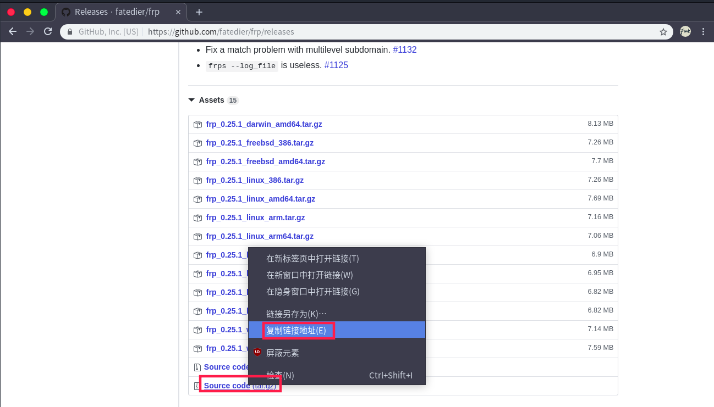

> 转载: [https://mogeko.me/2019/046/](https://mogeko.me/2019/046/)

[Homebrew](https://mogeko.me/2019/046/nrew.sh) 是最初是 Max Howell 自己写来管理 MacOS 软件的一个小工具，没想到后来直接火了。不仅成为了 [Github](https://github.com/Homebrew/brew) 上拥有贡献者最多的一个项目，还是 MacOS 系统中事实上的包管理器。

所以 Homebrew 到底又什么过人之处，能够得到这么多人的爱戴？其实并没有什么特别的地方，究其原理 Homebrew 并不比 apt / yum 高明，甚至 Homebrew (从源码) 安装软件的方式还可能存在安全性的问题。Homebrew 可能确实不是一个好的包管理器，但确实能解决问题，虽然原理丑陋了一点，但总比手动管理依赖舒服吧！

除了官方包管理器的缺失外，Homebrew 能上位的另一个重要原因是它天生的“平民属性”。说白了，其实 Homebrew 就是一堆用 Git 管理起来的安装脚本，这大大降低了发布软件的门槛——人人都能编写脚本，发布软件——这也是为什么 Homebrew 会成为 Github 上拥有贡献者最多的项目(永远不要低估人们对于管理自己的软件的热情，想想又多少人是为了 AUR 选择 Arch Linux 的)。这也是为什么我要写这篇文章，教大家如何通过 Homebrew 维护属于自己的软件仓库。

## 基本概念

在 Homebrew 的体系中，**至少**有这么 4 层 ：

- Tap：软件仓库 (Git 仓库)
- Formula (配方)：定义如何下载、编译和安装脚本或软件的 Ruby 脚本；是 Homebrew 的灵魂
- Cellar (酒窖)：所有用 Homebrew 安装在本地的脚本或软件组成的集合
- Keg (酒桶)：安装好的脚本、软件等

怎么都是酒？Homebrew 本身就是“家酿”的意思，它的基本工作原理也是将源码下载下载本地编译；自己体会吧~~

我们从上到下来看一下，Tap 实际上就是一个 Git 仓库，也是软件仓库，但与别的包管理器不同的是，Tap 存放的不是已经编译好的二进制文件，而是 Formula，也就是**用来下载、编译和安装脚本或软件的 Ruby 脚本**。举个例子，假如我们想要安装软件 `foo`，我们输入命令 `brew install foo`，Homebrew 就会在 Tap 在中寻找与软件 `foo` 对应的 Ruby 脚本，然后按照该脚本定义的方法将 Keg (`foo`) 下载、编译、安装到 Cellar 中。

是不是有点绕？没关系，这些概念没必要记得这么清楚，了解个大概，看到了知道是什么东西就可以了。

Homebrew 的官方为我们提供了两个官方 Tap，`homebrew/homebrew-core` 和 `homebrew/homebrew-cask`。Homebrew Cask 是用来管理二进制包的，一般用来安装较为大型的软件，已经超出本文的范围了，暂且不谈。而作为官方仓库 `homebrew/homebrew-core` 是肯定不会允许你随随便便上传 Formula 的。所以你需要另起炉灶，建立一个自己的 Tap 来存放 Formula。

## 创建 Tap

前面已经提到过了，Tap 实际上就是 Git 仓库 (一般部署在 Github 上面)。不过这个仓库稍微有点特殊，它需要以 `homebrew-xxx` 的形式进行命名。就例如我的 Tap 仓库就叫作 `Mogeko/homebrew-taps`。

我们先在 Github 上创建相应的仓库，然后我们运行以下命令让 Homebrew 可以跟踪我们的 Tap：

```
$ brew tap Mogeko/taps
```

或者

```
$ brew tap github.com/Mogeko/homebrew-taps
```

这也就是为什么要让大家以 `homebrew-xxx` 的形式命名的原因了，因为只有这种以这种形式命名的仓库可以直接使用 `[Owner]/xxx` 这样比较短小好记的命令追踪 Tap，如果不已这样的方式命名或者部署到别的代码托管平台就只能用第二个比较长的命令了。

## 创建 Formula

有了仓库，是时候酿点酒了 (～o￣▽￣)～[ ]

首先，在 Tap 的根目录下创建一个名为 `Formula` 的文件夹，我们所以的 Formula (Ruby 脚本) 都要放在这里。

然后创建 Formula，我们这里以 **frp** 为例。[**frp**](https://github.com/fatedier/frp) 是一款用来做内网穿透的代理程序，选它当例子主要是因为它比较好编译。

首先去 [frp 的 releases 页面](https://github.com/fatedier/frp/releases)，找到最新版的 **frp**，右键 `Source code.tar.gz` -> 复制链接地址。



然后打开终端，输入：

```
$ brew create https://github.com/fatedier/frp/archive/v0.25.1.tar.gz
```

Homebrew 会在 `/usr/local/Library/Formula/` 下创建一个名为 `frp.rb` 的文件，将这个文件放入 Tap 的 `Formula` 文件夹中，然后打开它。

```ruby
# Documentation: https://docs.brew.sh/Formula-Cookbook
#                https://www.rubydoc.info/github/Homebrew/brew/master/Formula
# PLEASE REMOVE ALL GENERATED COMMENTS BEFORE SUBMITTING YOUR PULL REQUEST!
class Frp < Formula
  desc "A fast reverse proxy to help you expose a local server behind a NAT or firewall to the internet."
  homepage ""
  url "https://github.com/fatedier/frp/archive/v0.25.1.tar.gz"
  sha256 "33bda2e559f072e8423d8ef84a66b150c4a5fe986c892cbdd8b5bebe2f7956be"
  # depends_on "cmake" => :build
  def install
    # ENV.deparallelize  # if your formula fails when building in parallel
    # Remove unrecognized options if warned by configure
    system "./configure", "--disable-debug",
                          "--disable-dependency-tracking",
                          "--disable-silent-rules",
                          "--prefix=#{prefix}"
    # system "cmake", ".", *std_cmake_args
    system "make", "install" # if this fails, try separate make/make install steps
  end
  test do
    # `test do` will create, run in and delete a temporary directory.
    #
    # This test will fail and we won't accept that! For Homebrew/homebrew-core
    # this will need to be a test that verifies the functionality of the
    # software. Run the test with `brew test frp`. Options passed
    # to `brew install` such as `--HEAD` also need to be provided to `brew test`.
    #
    # The installed folder is not in the path, so use the entire path to any
    # executables being tested: `system "#{bin}/program", "do", "something"`.
    system "false"
  end
end
```

让我们一条一条的分析。

### 基本信息

我们可以看到类的头部有 4 个变量：

```ruby
desc "A fast reverse proxy to help you expose a local server behind a NAT or firewall to the internet."
homepage ""
url "https://github.com/fatedier/frp/archive/v0.25.1.tar.gz"
sha256 "33bda2e559f072e8423d8ef84a66b150c4a5fe986c892cbdd8b5bebe2f7956be"
```

他们分别表示 **简介 (decs)**、**主页地址 (homepage)**、**源码地址 (url)**和**源码的哈希特征码 (sha256)**

其中三项 Homebrew 已经帮你填好了，剩下的一项主页地址按照实际情况填写就可以了。

### 依赖

然后是依赖部分，**frp** 使用 Golang 开发，所以在编译时需要依赖 Golang，我们添加上

```
depends_on "go" => :build
```

然后 Homebrew 就可以自动帮我们处理依赖了。其中 `:build` 表示在编译时依赖，相似的还有

```
:test => 在运行 brew test 时依赖:option => 没用过，不知道有啥用:recommended => 也没用过:xcode => 需要依赖 Xcode
```

更多信息请参考 [Homebrew 官方文档: Formula Cookbook](https://docs.brew.sh/Formula-Cookbook)

### 编译 (安装)

终于到了最激动人心的编译环节了。首先将`install` 中的东西全部删光。它给的示例只是一个参考，并不适用于我们的项目。

```ruby
def install
  ENV["GOPROXY"] = "https://goproxy.io"
  system "make"
  bin.install "bin/frps"
  bin.install "bin/frpc"
end
```

**frp** 的根目录中有一个 `go.mod` 文件，说明这个项目是支持 Go Module 的。同时，考虑到国内糟糕的网络环境，我们可以考虑通过环境变量 `GOPROXY` 设置一个代理。同时 **frp** 提供了 `makefile` 文件，所以我们直接运行 `make` 即可编译。编译好后得到两个二进制文件 `bin/frps` 和 `bin/frpc` 他们分别是 **frp** 的服务端和客户端。通过 `bin.instal` 将编译好的二进制文件安装到 `/usr/local/bin/` 中。

此时，在终端中执行便可开始安装

```sh
$ brew install frp==> Downloading https://github.com/fatedier/frp/archive/v0.25.1.tar.gzAlready downloaded: /Library/Caches/Homebrew/downloads/232cf62ed11cd378e4be4ff49e5469fa3d62b69ab11668bba02af2db080669f6--v0.25.1.tar.gz==> make......
```

如果没报什么错的话就说明安装成功了。

### 测试 (可选)

有时候安装成功了，但功能不一定完备。我们还可以写两个测试用例来测试一下功能是否完整。

例如，我这里测试了安装的版本是否正确。

```ruby
test do
  output_s = shell_output("#{bin}/frps -v")
  assert_match "#{version}", "v"+output_s
  output_c = shell_output("#{bin}/frpc -v")
  assert_match "#{version}", "v"+output_c
en
```

在终端中输入

```sh
$ brew test frpTesting mogeko/taps/frp==> /usr/local/Cellar/frp/v0.25.1/bin/frps -v==> /usr/local/Cellar/frp/v0.25.1/bin/frpc -v
```

没有报错就说明测试成功。


至此我们的 Formula 就已经完成了，此时的 `frp.rb`：

```
class Frp < Formula
  desc "A fast reverse proxy to help you expose a local server behind a NAT or firewall to the internet."
  homepage "https://github.com/fatedier/frp"
  version "v0.25.1"
  url "https://github.com/fatedier/frp/archive/#{version}.tar.gz"
  sha256 "33bda2e559f072e8423d8ef84a66b150c4a5fe986c892cbdd8b5bebe2f7956be"
  depends_on "go" => :build
  def install
    # ENV["GO111MODULE"] = "on"
    ENV["GOPROXY"] = "https://goproxy.io"
    system "make"
    bin.install "bin/frps"
    bin.install "bin/frpc"
  end
  test do
    output_s = shell_output("#{bin}/frps -v")
    assert_match "#{version}", "v"+output_s
    output_c = shell_output("#{bin}/frpc -v")
    assert_match "#{version}", "v"+output_c
  end
end
创建 Bottle (可选
```

## 创建 Bottle (可选)

虽说 Homebrew 的基本使用方式是**下载源码** -> **本地编译** -> **安装**。但实际生活中使用得更多的却是已经编译好的二进制包，也就是 Bottle。一个 Formula 如果有 Bottle 的话 Homebrew 会默认使用 Bottle，这样除了安装更快以外，也更安全。`homebrew/homebrew-core` 中的 Formula 一般都提供了 Bottle。如果条件允许的话，最好为自己的项目添加 Bottle，但二进制文件的分发又成了新的问题。

Bottle 在 Ruby 脚本中长这样：

```ruby
bottle do
  sha256 "4921af80137af9cc3d38fd17c9120da882448a090b0a8a3a19af3199b415bfca" => :sierra
  sha256 "c71db15326ee9196cd98602e38d0b7fb2b818cdd48eede4ee8eb827d809e09ba" => :el_capitan
  sha256 "85cc828a96735bdafcf29eb6291ca91bac846579bcef7308536e0c875d6c81d7" => :yosemite
end
```

中间 3 行的 sha256 是二进制文件的哈哈希特征码，后面的 `:sierra`、`:el_capitan` 和 `:yosemite` 是二进制文件对应的系统版本。

Bottle 还可以定义 `root_url` 等，具体可以参考：[Homebrew 官方文档: Bottle](https://docs.brew.sh/Bottles)

### 制作 Bottle

通过一下两行命令就可以轻松的制作 Bottle 了 (如果已经安装过 **frp** 的话使用 `reinstall`)：

```sh
$ brew (re)install --build-bottle frp$ brew bottle --json frp
```

不出意外的话会在当前目录下生成两个新文件：`frp--v0.25.1.x86_64_linux.bottle.json` 和 `frp--v0.25.1.x86_64_linux.bottle.tar.gz`。`frp--v0.25.1.x86_64_linux.bottle.tar.gz` 就是打包好的二进制文件。配置好 `frp.rb`，然后将其上传到 Github Releases 等分发平台就可以了。

可以用 Travis CI 等持续集成平台来制作与发布 Bottle，我没试过，有兴趣的同学可以自己研究一下。

## 相关文章

- [**使用 Travis CI 自动维护软件仓库 (Homebrew)**](https://mogeko.github.io/2019/049/)