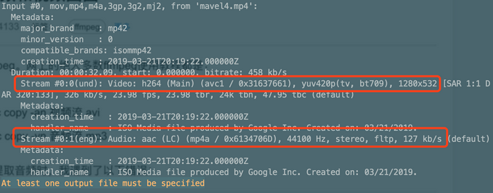

> [使用 ffmpeg 分离视频流和音频流](https://wxnacy.com/2019/04/16/ffmpeg-split-video-audio/)

通常情况下，我们提到“视频”会有两个要素，声音和画面。但其实严格意义上说视频中含有**视频流**和**音频流**，如果一个视频只有视频流，那么就只有画面没有声音，反之亦然。


我有听英语电影原声的习惯，但是总是放视频很不方便，网上的资源又不是太称心如意，就想着自己动手来分离，我首先想到的是 ffmpeg。

我们先来看看视频中的这两个流

```
$ ffmpeg -i mavel4.mp4
```



执行该命令可以直接查看视频的信息，其中就有刚才的提到的**视频流（Video: h264）**和**音频流（Audio: aac）**

使用参数 `-vcodec copy -an` 和 `-acodec copy -vn` 可以分离出视频流和音频流。

**分离视频**

```
$ ffmpeg -i mavel4.mp4 -vcodec copy -an mav.mp4
```

等待转码成功后，观看 `mav.mp4` 发现已经没有声音了，查看发现只有一个流


**分离音频**

```
$ ffmpeg -i mavel4.mp4 -acodec copy -vn m.m4a
```

再次查看音频流信息


网上很多博客都是直接甩一个类似这样的命令

```
$ ffmpeg -i mavel4.mp4 -acodec copy -vn m.mp3
```

如果你执行的话，多半会报错，因为查看视频信息，很可能像例子中的音频流一样是 aac 格式的，什么是 aac 格式呢

> 高级音频编码（英语：Advanced Audio Coding，AAC），出现于1997年，为一种基于MPEG-2的有损数字音频压缩的专利音频编码标准，由Fraunhofer IIS、杜比实验室、AT&T、Sony、Nokia等公司共同开发。2000年，MPEG-4标准在原本的基础上加上了PNS（Perceptual Noise Substitution）等技术，并提供了多种扩展工具。为了区别于传统的MPEG-2 AAC又称为MPEG-4 AAC。其作为MP3的后继者而被设计出来，在相同的比特率之下，AAC相较于MP3通常可以达到更好的声音质量[2]。

关键是下面这句

> AAC 被YouTube、iPhone、iPod、 iPad、 任天堂DSi、任天堂3DS、iTunes、DivX、PlayStation 3和多款Nokia 40系列、Sony Ericsson手机采用为默认的音频编码格式，并且被PlayStation Vita、Wii、Sony Walkman MP3系列及随后的Android、BlackBerry等移动操作系统支持。

也就是说，现在很多视频的音频流都将是这个格式，那直接分离 `mp3` 格式的音频自然会报错。

那我就是想要 `mp3` 的音频该怎么办呢？

再来一次转码

```
$ ffmpeg -i m.m4a m.mp3
```

或者直接将视频转码为 `mp3` 格式。

```
$ ffmpeg -i mavel4.mp4 m.mp3
```

- [高级音频编码](https://zh.wikipedia.org/wiki/進階音訊編碼#相較於MP3的改進)