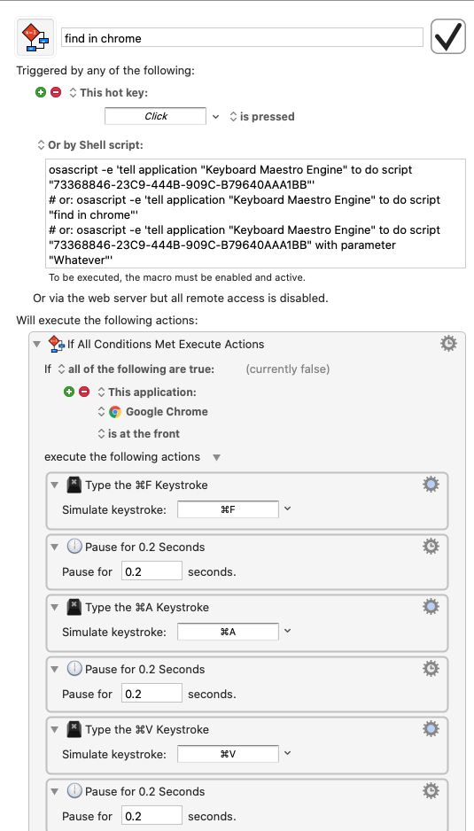

看swiftUI的时候,想查一下swift的数组的语法,打开dash,发现swift的帮助包没安装.突然想到自己已经不是第一次遇到了. 于是自己立个项:如何方便快速的查找语言的基本语法参考.


* 想到直接用alfred来做来查询界面入口,键入lang swift array,就可以显示相关的信息.

*  数据如何存呢?文本文件

* 数据如何分类呢?各种语言,每个语言有一些特性

* 文本文件吧

  ```swift
  <<<<swift,array
  let shoppingList = ["catfish", "water", "tulips",] //commas are allowed after the last element
  let secondElement = shoppingList[1] // Arrays are 0-indexed
  >>>>
  ```

* 又想到这些数据也需要方便的管理,主要是增加,alfred也应该增加管理的功能

* 前期的这些基本的数据从哪来呢?

* 关键字多个的话如何查询呢

* bash做检索太麻烦,使用ruby吧

* alfred的list不支持多行功能,没有这个的话,一些代码只能显示一行,没法看了

* 查了一圈,发现有人提出类似的问题,但好像无解,list本来就是给你一个入口,不是用来展示具体内容的

* alfred的论坛403,被墙了

* 又想到基本的数据要自己初始化,整理,头大.那么多语言.虽然可以从自己想学习的几门语言开始

* alfred的list方式来展示不可行,放弃.

* 中间2小时无解

* 突然想到 https://learnxinyminutes.com/这个网站

* 数据应该有了,而且还不要维护

* github开源,都是markdown

* 解析mardown?查找,解析?

* 工作量太大了.

* 能不能直接就在浏览器上看呢?

* 要快,简单

* 那就还是在afled里 键入`lang swift array`,直接打开对应的语言参考页面,并且触发查找,把array作为关键字.

* 这样还行,基本符合最初的想法,唯一不足是会打开浏览器,不像有些插件直接就在小窗口里完成了.

* 开始做实现.

* 分拆query,第一次用. 了解到字符串为空就是啥也不用输入

* 打开页面很容易实现.

* alfred里没有操作具体UI的按键实现

* 那后半截的操作用KM来实现吧

* alfred实现打开页面,后面的在chrome里的查找用KM实现,alfred调用 就好了.

* km实现很容易,2分钟

* 打开网页应该需要些时间,所以alfred打开网页后给了个5秒的delay,后来发现不需要 ,网页加载是否完成,跟find没有依赖关系 .直接给到0.5秒.

* KM里的操作少了个条件 ,加上chrome必须在front的条件

* 收工




