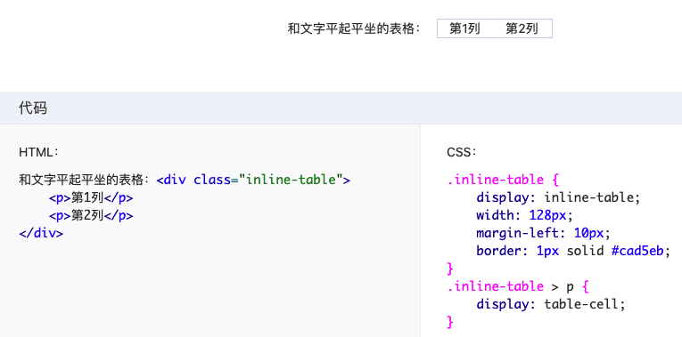

> Inline-block就是解决一些块级元素如何内联(不换行)显示的问题吧
>

块级盒子和内联盒子.前者负责结构(是否换行),后者负责内容.

list-item需要显示符号,所以除了本身的块盒子,又整了一个附加盒子

最终,无论是块级盒子还是内联盒子都有两个盒子,一个是外面的,一个是里面的.同样,外面的负责结构,是面负责内容.

名子再优化一下. 外面的盒子叫块级盒子,里面的叫地级容器盒子.

所以内联的元素也是可以设置height,width的.就是因为有2个盒子.外面的是inline,里面的是block,block就是可以设置高宽的. display:inline-block

display:inline-table 如图

