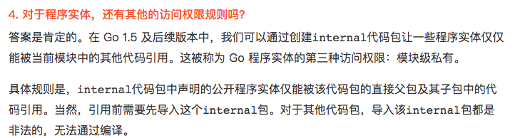

## 3杂

* import "net/http" 

net/http 是目录名,虽然建议目录名与目录下的文件的包名一至,如果不一致的话,代码中调用还是用pkgname.method这样的方式调用.  i**mport 主要的作用还是在编译时查找包的路径,调用是运行时的概念,当然要用包名,所以最好目录名与包名要统一,不要引起不必要的歧义**

* go install [pkgname]  

后面跟的是包名,但如果src目录下没有[pkgname]同名目录则报错,所以还是建议包名与目录名同名,特别是可运行文件也建议建立一个main目录,入口文件在main目录中.这样统一比较好

install的是包,至于这个包在哪,按搜索的规范来,先是GOROOT,再是GOPATH

* go run [pkgname]

go run file.go 也可以,先找到文件,找到文件中的包,再做编译运行.   很容易以为 run的后面跟的是具体的文件.

* 使用go module 那就不要在GOPATH上新建项目,应该在GOPATH目录外.

  如果一定要在GOPATH中使用module 

  ```sh
  export GO111MODULE=on
  ```

  

* 同一个包里的函数互相可以调用,函数名不需要是大写

* main包里的多个文件无法互相访问.

* import fm "fmt"   // 别名


### 包名与引用的关系

```go
//src/hello/lib/one_lib.go
package lib5  
```

import 是目录的路径名称

调用是package 声明的名称.   所以包的目录名要与声明的包名一至,避免使用者产生困惑.


### Go中struct匿名属性

Go语言中struct的属性可以没有名字而只有类型，使用时类型即为属性名。（因此，一个struct中同一个类型的匿名属性只能有一个）

type PersonC struct {
	id      int
	country string
}

//匿名属性
type Worker struct {
	//如果Worker有属性id,则worker.id表示Worker对象的id
	//如果Worker没有属性id,则worker.id表示Worker对象中的PersonC的id
	id   int
	name string
	int
	*PersonC
}

func structTest0404() {
	w := &Worker{}
	w.id = 201
	w.name = "Smith"
	w.int = 49
	w.PersonC = &PersonC{100001, "China"}

	fmt.Printf("name:%s,int:%d\n", w.name, w.int)
	fmt.Printf("inner PersonC,id:%d,country:%s\n",
		w.PersonC.id, w.PersonC.country)
	
	fmt.Printf("worker.id:%d,personC.id:%d\n", w.id, w.PersonC.id)
	/*output:
	name:Smith,int:49
	inner PersonC,id:100001,country:China
	worker.id:201,personC.id:100001
	*/
}


## 使用 Go Modules 后，不再需要以下内容：

不用再定义 GOPATH （这里指的是 go build 、 go install 等等 go 命令。IDE 插件目前还是需要 GOPATH）
工程目录放置，不再需要 src 目录下 （同上情况）
不再需要 vendor 机制以及其他第 3 方 dep 工具
工程内不再有依赖库代码。


## 变量重声明

```go
	var err error
	n, err := io.WriteString(os.Stdout, "Hello, everyone!\n") // 这里对`err`进行了重声明。
	if err != nil {
```


## **以下的截图需要作详细理解并作笔记**



