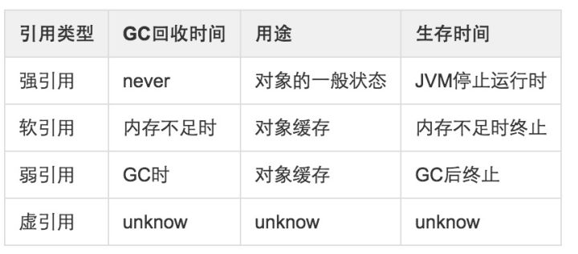

### 一些需要知道结论

1. 线程是不允许多次调用start(),会报IllegalThreadStateException
2. 


### 强,软,弱,虚 引用 



### String,StringBuilder,StringBuffer

String是imutable	

StringBuilder  线程不安全

StringBuffer  线程安全

线程安全通常有更多的开销. 现在的JVM对于一般的使用String拼接会有优化,除非特别频繁的字符串操作,否则不必在意


### 原始类型线程安全

int,float这些原始类型并不是线程安全的,如果要保证线程安全请使用AtomicXXX这样的线程安全类.

```java
import java.util.concurrent.atomic.AtomicInteger;

public class SampleThree extends Thread
{
    static long wakeUpTime = System.currentTimeMillis() + (1000*20);
    static AtomicInteger inT = new AtomicInteger();
    public static void main(String args[])
    {
        System.out.println("initial:" + inT);
        for(int i=0; i<500; i++)
            new SampleThree().start();
        try {
            Thread.sleep(wakeUpTime - System.currentTimeMillis() + (1000*30));
            System.out.println("o/p:" + inT);
        }
        catch(Exception e){
            e.printStackTrace();
        }
    }

    public synchronized void  run()
    {
    	{
        try {
            long s = wakeUpTime - System.currentTimeMillis();
            System.out.println("will sleep ms: " + s);
            Thread.sleep(s);
            inT.addAndGet(1); // System.out.println(inT);
        }
        catch(Exception e) {
            e.printStackTrace();
        }
    }
    }
}
```

# 