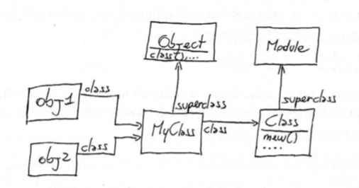
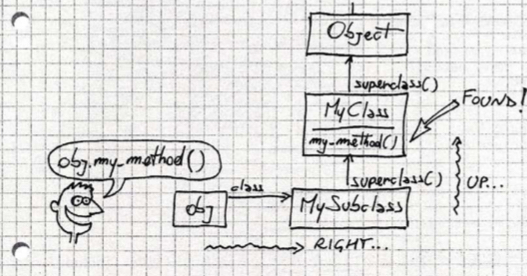
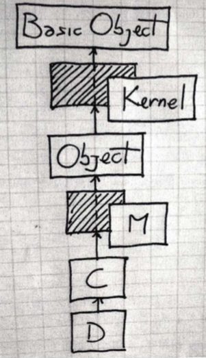
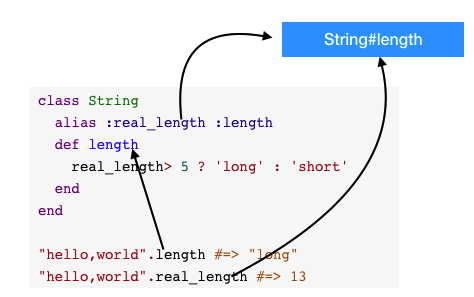
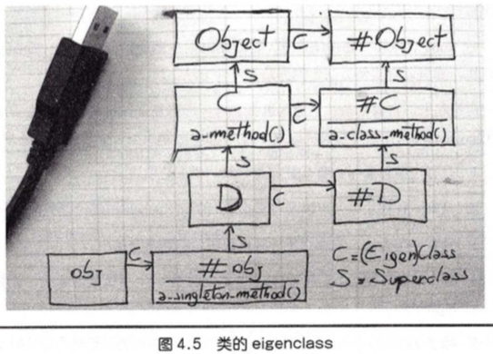

# Ruby的一些笔记

### Ruby原理

1. 使用Ripper对ruby脚本进行分词
2. Yacc,解析器,ruby使用了更高级的Bison,他们使用以`.y` 扩展名的语法文件
3. 

### 提问题

1. print pus区别

2. 函数或方法的最后一行可以直接写值作为返回值,但程序最后一行要显示声明.与其他语言如shell混编,要用print输出而不是直接return 

   ```ruby
   def hello
     'world'
   end
   
   print 'world'
   # return 'world' # shell无法获取这个值
   ```

   

### 容易搞错的问题

#### 正则的顺序

```
str =~ obj → integer or nil
```

- 如果obj是一个正则表达式，则用此正则去匹配str，匹配成功则返回匹配到的第一个字符的位置，否则返回nil
- 如果obj不是正则表达式，则调用`obj.=~(str)`，即调用obj的`=~`方法，然后以str作为参数

注：**str =~ reg 和 reg =~ str是不同的**，如果reg里有命名捕获，则只有第二种才会将捕获到的内容赋值到对应的变量当中。**所以在Ruby中，强烈建议将reg放在前面，这和Perl的位置顺序是相反的**。


### 字符串操作

#### 替换操作

gsub

replace  //完整替换

#### 去除空格

ltrip,rtrip

#### 去除换行分隔符

chop

1. 去除第一个字符  "hello"[1..-1]
2. 

### 一些不常见到的技巧

1. 类名是一个常量


### Ruby 里的 %Q, %q, %W, %w, %x, %r, %s, %i

#### %Q()

括号里的字符串外面加上双引号,并且括号里的双引号不需要转义

括号也可以使用其他的非数字的成对的符号表示.

`%Q[]` `%Q! !` `%Q+ +` 都是可以的,一般就用()就好.

```irb
%Q(He said: "Good!")
=> "He said: "Good!""
```

#### %q()

单引号,其他同%Q

%W

语法近似于`%Q`, 用于表示其中元素被双引号括起的数组.

```
>> %W(#{foo} Bar Bar\ with\ space)
=> ["Foo", "Bar", "Bar with space"] 
```

#### %w

用于表示其中元素被单引号括起的数组. 比较奇怪的是`\`(斜杠空格)会被转化成``(空格), 但是其他的内容不会.

```
>> %w(a b c\ d \#e #{1}f)
=> ["a", "b", "c d", "\\#e", "\#{1}f"]
```

#### %x

使用`方法执行一段shell脚本并返回标准输出内容.

```
>> %x(echo foo:#{foo})
=> "foo:Foo\n"    
```

#### %r

语法近似于`%Q`, 用于正则表达式.

```
>> %r(/home/#{foo})
 => /\/home\/Foo/ 
```

####  %s

用于表示symbol, 但是不会对其中表达式等内容进行转化

```
>> %s(foo)
=> :foo
>> %s(foo bar)
=> :"foo bar"
>> %s(#{foo} bar)
=> :"\#{foo} bar"
```

#### %i

Ruby 2.0 之后引入的语法, 用于生成一个symbol数组

```
2.0.0p247 :014 > %i(a b c)
=> [:a, :b, :c] 
```

### Ruby Gem命令详解

```ruby
//更新Gem自身
//注意：在某些linux发行版中为了系统稳定性此命令禁止执行
gem update --system

// 从Gem源安装gem包
$ gem install [gemname]

// 从本机安装gem包
$ gem install -l [gemname].gem

// 安装指定版本的gem包
$ gem install [gemname] --version=[ver]

// 更新所有已安装的gem包
$ gem update

// 更新指定的gem包
// 注意：gem update [gemname]不会升级旧版本的包，此时你可以使用 gem install [gemname] --version=[ver]代替
$ gem update [gemname]

// 删除指定的gem包，注意此命令将删除所有已安装的版本
$ gem uninstall [gemname]

// 删除某指定版本gem
$ gem uninstall [gemname] --version=[ver]

// 查看本机已安装的所有gem包
$ gem list [--local]
```


### inheritances & extend & include 的区别?

- inheritance :
  子类继承了父类的属性，包括访问这些属性的权限  (public/protected/private)，与其他编程语言不同的是，Ruby 能够访问父类的私有方法，甚至还可以把父类的私有方法转化为公有方法。
- include :
  在指定的类中 mixed in 模块 (module) 中定义的方法作为该类的实例方法。`include model` 等同于把模块中的代码复制到所在类中，减少代码重复。通过这种方式，突破了 Ruby 只允许单继承的限制。
- extend :
  把模块中的方法引入到当前类，并作为类方法。


### Object#extend

```ruby
module MyModule
  def my_method
    'hello'
  end
end
obj = Object.new
obj.extend MyModule
obj.my_method #=> "hello"

class MyClass
  extend MyModule
end
MyClass.my_method #=> "hello"
```


### Ruby 中的 module_function 和 extend self异同?

```ruby
module m
    extend self #写在方法定义上一行
    def hello
    end
end

module n
    def hello
    end
    module_function :hello
end    
```

`module_function` 改变模块内原方法的 public/private 属性并设置成模块方法,能够通过 `module_name.method_name` 的方法调用,因为改变了public/private属性,所以include进某个类的时候,这个方法也就不再可见(用)了。

`extend self` 就是在模块内自继承，不改变模块中方法的 public/private 属性，同样也能通过 `module_name.public_method` 的方法调用。inlude进某个类时当实例方法使用.

> 不确定模块是否独立使用或是mixin的情况下,想要直接以module.method方式使用模块内的方法,建议使用extend self. **这一点待确认**


### module_function 关键字?

```ruby
  module Utils
    #https://github.com/candlerb/webrick/blob/master/lib/webrick/utils.rb
    def create_listeners
      #sockets
    end
    module_function :create_listeners
  end
```

用于对module的方法对外进行公开,可以直接调用. Ex :  Utils.create_listeners

对于mixin,则不必使用. 

改变了方法的public/private属性, include进了类,这个方法也变为不可见,**慎用**


### class << self  class << obj 是什么意思?

```ruby
a = 'foo'
class << a
  def inspect
    '"bar"'
  end
end
a.inspect   # => "bar"

a = 'foo'   # new object, new singleton class
a.inspect   # => "foo"
```

打开a的单例类,可以在a的对象中定义新的方法. 这里的self是上下文中的对象.

**注意,这里的对象也可以是类,类定义的类本身也是对象**

如:

```ruby
module A
    class << self
    end
end
```

### 实例变量并不是`定义`出来的

```ruby
class A
  def m
    @m = "hello"
  end
end

```

如果没有运行 m的方法,那个@m是不存在的.**这跟java是完全不同的**

### 对象是变量,类名是常量



obj1是变量,MyClass是常量

其实都是对象,这个跟java里的类和对象的概念还是有些区别的.java里的对象和类从逻辑上更像是模具和产品关系

`任何大宝字母开头的都是常量 `


### 和Java,C#中的类相比有什么区别

在java和c#中,类也是Class的实例,但是Java中的类和对象有很大区别

1. 不能运行时创建类
2. 不能运行时修改类
3. class(类MyClass)更像是类的描述符,而不是`真正`的类,类似于JavaFile类不过是文件描述符,而不是文件本身

初学时的类比逻辑对于类和实例的深入理解是有障碍的.

### 如何选择Class和Module

命名空间使用时使用module

希望实例或是继承,使用类


### ::是什么

```ruby
module M
  Y = 'y const'
  class C
    ::M::Y  # 表示根路径 y const
  end
end

```


### 方法是怎么执行的

1. 对象中找对象本身定义的方法(较少)
2. 在对象的类定义中找方法,然后依次是这个类类mxin的模块(**这个容易忽略**)
3. 类的superclass中寻找,其中包括影子类(代理类/匿名类eigenclass)

*Eigenclasses位于方法查找的最底端，也就是说， 最先开始方法查找的地方就是这个对象自己的Eigenclass.*






阴影的部分是影子类

### self是什么

任何时刻,只要调用 某个对象的方法,这个对象就成为self,如果没有调用方法self是什么?

```ruby
self  # => main
self.class # => Object
```

ruby程序运行时,解释器会创建一个main的对象,这个对象被称为顶级上下文.所以这个时候self就是这个main

### 影子类/匿名类,类方法和实例方法

```ruby
#    Ruby元程序就是关于Self ：It’s All About the Self
#    所有ruby代码在ruby代码执行的过程中,是没有没有单独的编译或运行阶段. 在Ruby中，每一行代码是对一个特定对象的执行的
=begin
      一个匿名类（Anonymous Class）也被称作单例类（Singleton Class），特征类（Eigenclass），鬼魂类（Ghost Class），
  元类（Metaclass）或者 uniclass译名请求.
       Eigenclass: an object’s own class
       Metaclass: the class of a class
=end
 
#  每个对象都有一个它自己的独有的，隐藏的类。它被叫做： 那个对象的 eigen-class.
 
=begin
 eigenclass的作用域：
    class << an_object
        # your code that
    end
 如果你想得到一个eigenclass的引用，你可以在外部域返回一个self，例如：
    obj = Object.new
    eigenclass = class << obj
      self
    end
     > eigenclass          => #<Class:#<Object:0x2bccd0>>
     > eigenclass.class    => Class
=end
 
# 一个对象的Eigenclass 是其单例方法保存的地方
 
=begin
Eigenclasses and instance_eval()
  instance_eval():改变的是the current class类的Eigenclass.
Eigenclasses and Method lookup（lookup具体详见：方法调用）
  Eigenclasses位于方法查找的最底端，也就是说， 最先开始方法查找的地方就是这个对象自己的Eigenclass.
=end
 
# 目前为止我们可以编写一下五种方式，创建类方法：
#1
class Person
  def self.ni_ming_lei
    "this is a ni_ming_lei"
  end
end
#2
class Person
  class << self
    def ni_ming_lei
      "this is a ni_ming_lei"
    end
  end
end
#3
class << Person
  def ni_ming_lei
    "this is a ni_ming_lei"
  end
end
#4
Person.instance_eval do
  def ni_ming_lei
    "this is a ni_ming_lei"
  end
end
# 5
 
class Person
end
def Person.ni_ming_lei
  "this is a ni_ming_lei"
end
 
# 方法调用：
p Person.ni_ming_lei # =>"this is a ni_ming_lei"
 
# 至于使用那种看自己的习惯了~~~
 
# 我们知道eigenclass也是一个类，它也是一个对象，故而他也有自己的eigenclass。貌似极为少见。。。。
 
# 类的实例方法的书写
 
class Per
  def name
    "Test"
  end
end
Per.class_eval do
  def name
    "Matz"
  end
end
 
p Per.new.name #>"Matz"

```


### 类和对象的理解

跟java不同,java里的类就是类,对象就是类的实例.

ruby中的所有一切都是对象,但有时候需要说明类和实例的这种关系时,就需要明确上下文的概念

1. 一般情况下所说的类和实例,跟java中的没有太大差别
2. 在说类本身也是一个对象的时候,这个时候类就是对象,Class对应的就是类了

**有点定义的上递归感觉,当然这么说也不一定严谨**

### 方法调用的本质

```ruby
irb(main):018:0> 1+1
=> 2
irb(main):019:0> 1.send(:+,1)
=> 2
irb(main):020:0>
```


### 作用域

ruby中的作用域不像java中的inner scope或是块作用域的概念,内部可以看到外层的变量


```java
class A {
  int i
	void m(){
		// 这里是可以看到i的
	}
}
	
```

ruby的 class,module,def都是作用域的分隔门

```ruby
module A
	v1    #局部亦是这里看到有v1
  class B
    v2  #这里只看到v2
    def c
      v3 #这里只看到v3,看不到v2
    end
  end
  			#这里只看到v1
end

#如果想穿越这个门,不直接使用这三个关键字(使用闭包的方式来)

module A
  v1
  B = Class.new do 
    v2 #这里可以看到v1
    def c
      v3
      #这里可以看到 v1,v2
  end 
  
```


### instance_eval & instance_exec

可以扁平化作用域,说人话就是可以在代码块里访问对象的作用域内(私有)变量了

```ruby
class C
  def initialize
    @x=1
  end
end

c=C.new
c.x # Error
#如何访问c的@x, @x是不可以直接访问的 c.x
c.instance_eval {
	@x #这里就可以访问了  
}
```

### class_eval

class_eval实际上是重新打开了类,与instance_eval只改变self不同,class_eval 会同时改变self和当前类. 什么时候当前类?参考下文

### 什么是当前类

无论在ruby程序的那个位置,都有一个叫self的当前对象, 同时,也总有一个当前类(模块)存在,如果在一个方法里,该方法成为当前类的一个实例方法.


### 块不是对象

块不是对象,如何保存传递呢?

需要通过 Proc将块转换成对象,lambda也是同理

```ruby
inc = Proc.new {|x| x+1}
inc.call(2)  #=> 3
```


### proc &  lambda

`Proc.new()` `lambda()` `&` 

这三种方式创建的都是Proc对象,只是他们有些区别,很细微的区别但很重要,所以用不同的名称来表示.

* **return在Proc和Lambda中的区别**

在lambda中return表示从这个lambda返回

在Proc中表示从定义proc的作用域中返回 

```ruby
def d
  p=Proc.new{return 10}
  r=p.call  # 直接从定义proc作用域也就是方法d中返回
  return r*2  #不能执行到这
end

puts d  #=> 10 不是20

```

如果一定要用可以改成用显式reuturn方式(就是不写return)

```ruby
def d
  p=Proc.new{10} #显示return
  r=p.call  
  return r*2  
end

puts d  #=> 20
```

* 参数

  lambda对参数的检查严格

  proc会自己调整,这是问题的根源

  ```ruby
  p=Proc.new{|a,b| [a,b]}
  p.call(1,2,3) #=> [1,2]
  p.call(1) #=> [1,nil]
  ```


建议大多数情况下使用**lambda**

> 在ruby1.8中 Kernel#proc()是Kernel#lambda() 的别名,程序不断抗议,在1.9的版本中proc()变成Proc.new()的别名.

lambda的定义方式

```ruby
p = ->(x){x+1}

p = lambda {|x| x+1}
```


### 类宏 Class Macro

```ruby
class A
  attr_accessor :my_attribute
end

obj = A.new
obj.my_attribute = 'x'
obj.my_attribute # => "x"
```

实现自己的类宏

1. 当模块被引入的时候调用 self.included回调
2. 回调中将引入该模块的类进行extend扩展(类方法),就是将ClassMethods扩展为MyClass的类方法,这样my_attr就变成了MyClass的类方法
3. 在MyClass里就可以使用 my_attr :abc 这个类方法来进行方法定义了

```ruby
module MyModule  
  def self.included(base)    #当模块被引入的时候回调,base是引入该模块的模块(类)
    base.extend ClassMethods
    base.class_eval do 
      def my_instance_method
      end
    end
  end
  
  module ClassMethods
    def my_attr(str, &block) #block
      
      define_method(str) do
        @str
         #instance_variable_set("@#{str}", value)
      end 
      define_method("#{str}=") do |value|
        @str = value
      end
    end
  end
end

class MyClass
  include MyModule
  my_attr :abc
end

obj = MyClass.new
obj.abc = '10'
puts obj.abc  #10

# part 2
puts MyClass.instance_methods # [ my_instance_method, abc, abc=]
```


### 方法别名&环绕别名

方法别名

```ruby
class MyClass
  def my_method
    'hello'
  end
	alias :m :my_method
end

MyClass.new.m #=> "hello"

```

环绕别名(around alias)

先看代码

```ruby
class String
  alias :real_length :length
  def length
    real_length> 5 ? 'long' : 'short'
  end
end

"hello,world".length #=> "long"
"hello,world".real_length #=> 13
```

`alias` 把原来的length 映射绑定到 real_length上,后面的def定义的length已经跟上面的alias中的length无关了. 新定义的方法length中可以调用real_length(其实就是原来的length).  这样的方式适合用来为方法打补丁.

通常交换两个变量的值是通过一个临时变量来进行,可作类比理解.



**重要:**环绕别名一般情况下是要重定义原有的方法,否则会带来很大的风险


### 如何不知道类的名称在类里增加方法定义

class_eval()

```ruby
def add_method_to(a_class)
  a_class.class_eval do
    def m
      'hello'
    end
  end
end

```


### 类变量尽量不要使用

@@v

```ruby
@@v = 1
class MyClass
  @@v = 2
end
#@@v=> 2
```

类变量有点像java是的静态变量,但是不能等同理解.

类变量严格意义上并不属于类,属于类体系结构.上面的@@V定义于main的上下文,它属于main类的Object的,也属于Object的所有后代.有点像全局变量了.

**还是不要使用为好**

### 单件方法

ruby中,对象的类型并不严格与它的类相关,它的`类型`只是一组它能响应的方法而已.

> 这一点跟GO语言的接口还是很类似的.

类方法的实际上就是一个类的单件方法.

单件方法和类方法的定义是一样的.


对象的单件方法,就是只在这个对象上定义的方法,只作用于这个对象

类的单件方法,只是类这个对象上定义的,



### public ,protected, private

首先来看这段代码：

```ruby
class Test    
  def method_public
    puts  "In method_public"    
  end  

  def method_protected
    puts "In method_protected"     
  end  

  def method_private
    puts "In method_private"   
  end

  protected :method_protected
  private   :method_private
end

test=Test.new

分别尝试：

    test.method_public
    输出：In method_public

    test.method_protected
    输出：test.rb:20: protected method `method_protected' called for #<Test:0x3756068> (NoMethodError)

test.method_private

    输出：test.rb:21: private method `method_private' called for #<Test:0x346070> (NoMethodError)

```


**可知：public能被实例对象调用，protected和private不能被实例对象直接调用。**


改写代码：

```ruby
class Test    
  def method_public
    puts  "In method_public" 
  end

  def method_protected
    puts "In method_protected"     
  end  

  def method_private
    puts "In method_private"   
  end

  protected :method_protected
  private     :method_private

  def access_method
    puts method_public
    puts method_protected    
    puts method_private
  end

end

test = Test.new
test.access_method
输出：
In method_public
nil
In method_protected
nil
In method_private
nil
```


**可知：三种方式都能被定义它们的类访问。**


改写代码：

```ruby
class Test    
  def method_public
    puts  "In method_public" 
  end

  def method_protected
    puts "In method_protected"     
  end  

  def method_private
    puts "In method_private"   
  end

  protected :method_protected
  private   :method_private
end

class SonTest < Test
  def access_method
    puts method_public
    puts method_protected    
    puts method_private
  end
end

test = SonTest.new
test.access_method
输出：
In method_public
nil
In method_protected
nil
In method_private
nil
```


**可知：三种方法都能被定义它们的类的子类访问。**


改写代码：

```ruby
class Test    
  def method_public
    puts  "In method_public" 
  end

  def method_protected
    puts "In method_protected"     
  end  

  def method_private
    puts "In method_private"   
  end

  protected :method_protected
  private   :method_private

  def call_method_protected(testmember)
    puts testmember.method_protected
  end
  def call_method_private(testmember)
    puts testmember.method_private
  end

end

test1 = Test.new
test2 = Test.new

分别尝试：
test2.call_method_protected(test1)

输出：

In method_protected
nil

test2.call_method_private(test1)

输出：test.rb:21:in `call_method_private': private method `method_private' called for #<Test:0x36c5af4> (NoMethodError)
```


**可知：protected方法可以被其他的实例对象访问，而private方法只能被自己的实例对象访问。**


总结一下


public方法可以被定义它的类和子类访问，并可以被类和子类的实例对象调用；

protected方法可以被定义它的类和子类访问，不能被类和子类的实例对象调用，但可以被该类的实例对象(所有)访问；

private方法可以被定义它的类和子类访问，不能被类和子类的实例对象调用，且实例对象只能访问自己的private方法。


以上的陈述中，请注意“调用”和“访问”的区别。


### 绑定对象

通过binding对象来捕获并带走当前的作用域,接下来通过eval,instance_eval,class_eval在binding对象所携带的作用域中执行代码

```ruby
class A
  def my_method
    @x = 1
    binding # Kernal中的方法,返回binding对象
  end
end

b = A.new.my_method
eval "@x", b  # => 1
```

Ruby还提供了一个名为 TOPLEVEL_BINDING预定义常量,代表顶级作用域的对象 ,可以在任何地方 访问空虚顶级作用域

```ruby
class A
  def my_method
    eval "self", TOPLEVEL_BINDING
  end
end

A.new.my_method #=>main
```

**从某种意义上说,Binding是一个比块更"纯净"的闭包,因为它们只包含作用域而不包含代码**

eval() 有三个可选参数,第一个是binding对象,第二个是文件 ,第三个是line,正是这三个参数,irb在执行代码的异常的时候可以跟踪调用栈的信息.


### here文档 (<<END END)

s = <<END

​	这是一个多行注释

类似javadoc里的preview,但是比其更好用

END


### eval()的安全

ruby提供了$$SAFE的全局变量,0-4提供由低到高的安全限制


# 