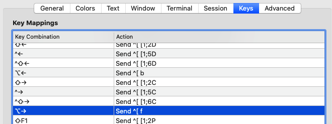

## normal和insert模式下设置不同光标

~/.vimrc 增加下面代码

```bash
" Change cursor shape between insert and normal mode in iTerm2.app
if $TERM_PROGRAM =~ "iTerm"
let &t_SI = "\<Esc>]50;CursorShape=1\x7" " Vertical bar in insert mode
let &t_EI = "\<Esc>]50;CursorShape=0\x7" " Block in normal mode
endif
```

## 光标按照单词快速移动设置





## iTerm2 备忘命令行快捷键

| 快捷键                                     | 作用说明                                                     |
| ------------------------------------------ | ------------------------------------------------------------ |
| command + f                                | **搜索&查找**，如果输入搜索内容后，按下 tab 键，就会 iTerm 自动帮选中搜索关键词，并且自动的帮我们复制到了剪贴板中。如果输入的是 shift+tab，则自动将查找内容的左边选中并复制。按 esc 退出搜索。 |
| command + k                                | 清空屏幕                                                     |
| command + d                                | 垂直分屏                                                     |
| command + shift + d                        | 水平分屏                                                     |
| command + ;                                | 查看历史命令                                                 |
| command + shift + h                        | 查看剪贴板历史，会自动列出输入过的命令                       |
| command + number                           | tab 标签窗口来回切换                                         |
| command + option + ←/→  或 command + [ / ] | 切换屏幕                                                     |
|                                            |                                                              |
| ctrl +  x                                  | 第一次按时，移动光标至行首；再次按时，回到原有位置           |
| ctrl + a                                   | 到行首（Ahead of line）                                      |
| ctrl + e                                   | 到行尾（End of line）                                        |
| ctrl + f/b                                 | 前进后退(相当于左右方向键)                                   |
| ctrl + u                                   | 清除当前行（无论光标在什么位置）                             |
| ctrl + d                                   | 删除光标当前位置的**字符**                                   |
| ctrl + h                                   | 删除光标之前的**字符**                                       |
| ctrl + w                                   | 删除光标之前的**单词**                                       |
| ctrl + k                                   | 删除光标当前位置到文本末尾的**所有字符**                     |
| ctrl + t                                   | 交换光标当前位置的字符与前一个字符的位置                     |
|                                            |                                                              |
| ctrl + c  或 ctrl + j  或 ctrl + o         | 取消当前行输入的命令（中断操作）。重新起一行。               |
| ctrl + y                                   | 粘贴之前（ctrl +u/k/w）删除的内容                            |
| ctrl + p                                   | 上一条命令。调出命令历史中的前一条（Previous）命令，相当于通常的上箭头 |
| ctrl + n                                   | 下一条命令。调出命令历史中的下一条（Next）命令，相当于通常的上箭头 |
| ctrl + s                                   | 冻结终端操作（暂停脚本）                                     |
| ctrl  + q                                  | 恢复冻结（继续执行脚本）                                     |
| ctrl + r                                   | 搜索命令历史。根据用户输入查找相关历史命令（reverse-i-search） |
| ctrl + l   或 command + r    或 clear      | 换到新一屏，创建一个空屏                                     |
| ctrl + i  或 tab                           | 横行制表符，在命令行中补齐指令                               |
|                                            |                                                              |
| !word                                      | 重复运行最近一条以“word”开头的指令，如!ls 或 !l              |
| !$                                         | 调用上一条指令的最后一个参数作为当前指令对象,如，假设上一条指令为： ls abc.txt bbc.txt 那么， vi !$ 相当于： vi bbc.txt |
| !number                                    | 调用执行指定编号的历史记录指令,如!2, !11                     |