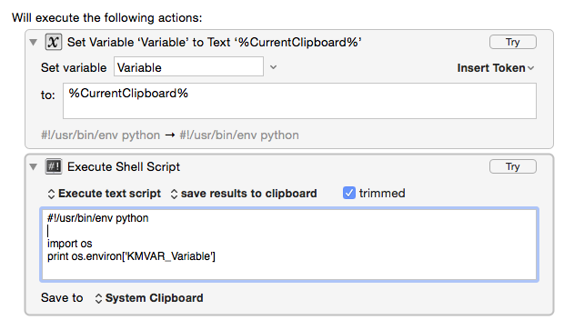
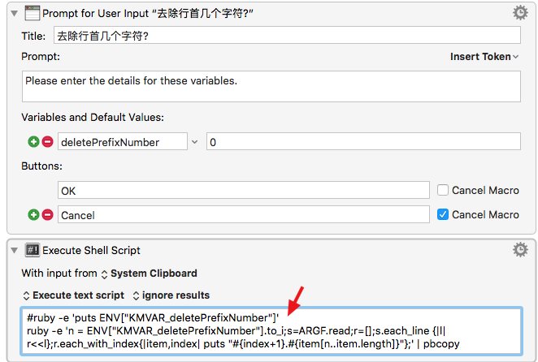

# Keyboard Maestro相关

### 资源

1. Full-featured library for writing Alfred workflows https://github.com/deanishe/alfred-workflow 
2. http://www.deanishe.net/alfred-workflow/index.html


### 变量引用方式

`%Variable%blogPostPath%`


### 如何指定运行脚本的数据编码

脚本运行前增加

```bash
export LC_CTYPE=UTF-8
```


### 如何输入一个参数

Prompt


### 输入的参数如何传递至执行的脚本中

Python:



Ruby:




### 变量与环境变量

KM中的定义的变量可通过环境变量获取,环境变量是在变量前增加前缀  KMVAR_变量名