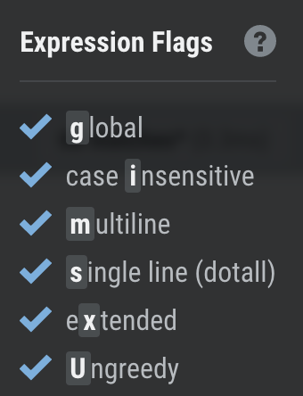
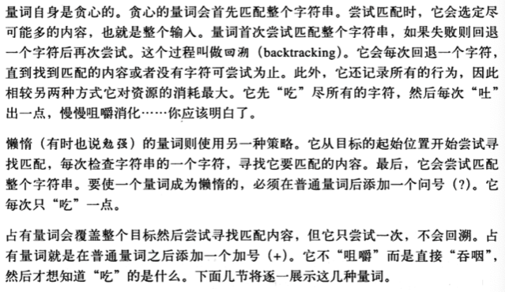
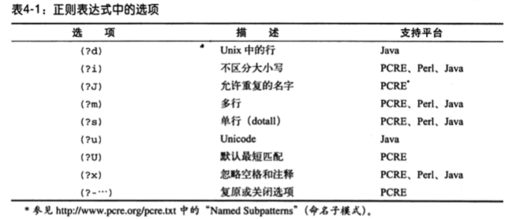
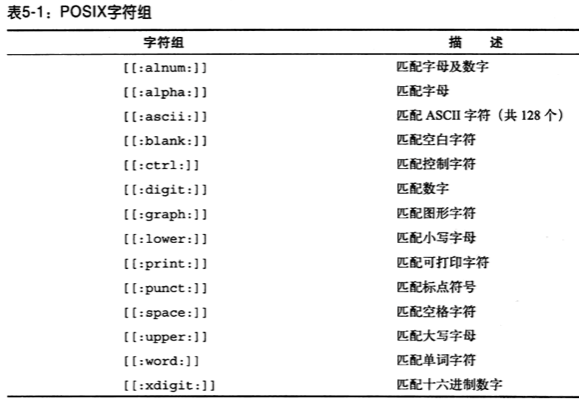

### 比较有用的示例

* 如何获取一行中最后一个匹配

  `xxx(?!xxx)`  其实就是环视的应用,就是xxx后面不能再有xxx的匹配了

* 

### 学习正则先了解这几个概念

1. 任意字符

   `.` 任意字符但不包括换行

   `[\s\S]`匹配任意字符.跟`.`的区别就是多了换行

   > `\s` 空格,tab,换行 
   >
   > `\S` (大写S)是`\s`的反义,除了\s的三个以外的其他字符

2. 匹配\>=0

   `*`

3. 匹配\>=1

   `+`

4. 匹配 0 or 1

   `?`

   `/https?/` 匹配 `https` (一个s) 或 `http` (0个s)

    >非贪婪模式 ,应该叫最小匹配更容易理解
    >
    >有问号就是最小范围内匹配,反之就最大范围内匹配
    >
    >`
a

b
`
    >
    >/
(.*?)
/
    >
    >加?号就是2个匹配,不加?匹配整个字符串

5. 转义 `\`

6. `[]` 单字符取一个,[abc]会匹配 a或b或c

   [0-9],[z-zA-Z]

7. `^`字符开始

   `^`如果在`[]`里,代表`非`,表示匹配不在括号里的字符

8. `$`字符串结束

9. 循环次数 `{n1,n2}`  不太明白?

   `[0-9]{1,3}`表示在0-9的范围里面循环1个、2个或者3个，可能结果有5、20、415等。
   如果循环指定次数，如3次，则`{3,3}`可以简写成`{3}`。
   如果刚好需要匹配字符`{1}`，则正则需要给`{`进行转义，得到`\{1}`的正则。
   如果`{}`中间不是数字，则`{}`本身不需要转义。

10. `?` 的用法,参考4

11. 多选一

    `(http|ftp)`

12. `()`

13. `(?:)`

14. 分隔符 `/`

15. 模式修饰符 

    如i,不区分大小定`/[a-z]/i`

16. 子模式是什么?

其他

`\1` `$1`

### 正则表达式如何学习

1. 匹配单个字符
2. 匹配一组字符
3. 元字符
4. 重复匹配
5. 位置匹配
6. 子表达式
7. 回溯引用
8. 前后查找
9. 嵌入条件

### 『学习正则表达式』笔记

#### 全局设置

//gi等

#### 一词多义

/^/  [^]

/https?/ \d?

[\b] \b

#### 捕获分组

() 内的内容表示分组

`707|827|7019`

(\d)\d\1

解释: 第一个括号内的\d匹配了`7`,并将这个匹配捕获(保存),\1对前面第一个捕获(保存)进行引用,实际上是动态的引用了括号内(\d)内容,有点类似 bash字符串中的变量引用.

捕获分组这样的翻译不易懂,应该有更好的方式

#### 匹配字符

数字字符,`\d`  

非数字字符`\D`, 有点像vi里的命令,大小写有时候表示反义,如 gg G

单词`\w` **这里指的是字母和数字,对中文无效**

非单词 `\W` **非字母和数字,符号空格都包括,中文也包括了**

空白 `\s` 会匹配 空格,制表符,换行,回车.(**注意空白不是空格**)

非空白`\S`

> 这里只有 \s\S可以组合使用,匹配所有的字符,其他的组合像\d\D定义就是错误的,一个字符不可能是数字又不是数字

`[^\t\n\r]`  和 `[^\s]` 是等价的

`^` 在[]里表示`非`

#### 量词

贪心,懒惰和占有

> lazy模式的在不同的引擎下表现有可能不一样
>
> 比如 5*?  有的是就一个也不匹配,有的是至少匹配一个.

> 匹配的数量,有点像vi里的 dd3中的3

`0|1`  ?  

`>=0`  *

`>=1`  +

指定数量  {n}

指定最小数量最大数量 {n1,n2}

> 问号有两种使用模式
>
> 1. 对于普通字符,表示前一个字符可有可无
> 2. 对于匹配模式表示最小匹配(非贪婪模式)

#### 边界

行的起始结束 `^` `$`

 单词边界`\b`   ,**注意:在[]里的[\b]是退格符**

 非单词边界`\B`

> 非单词边界其实就是当前的字符不能是字符数字之外的符号,主要用于匹配一个词的中间起始部分(可不够准确)

\z \Z 需要了解一下,不是所有的语言中都可用

使用元字符字面量

`\Q`$*+?` \E`  之间元字符可以不用使用转义,类似于ruby中的 %Q(hello,"world"),里面的双引号不用转义.

#### 选择

`(the|The|THE)`

选项 (?i)the    这个应用的范围如何理解??

#### 引用 

**子模式**, (the|The|THE) 就有3个子模式,三个模式没有依赖关系,而(t|T)h(e|E),就有依赖关系了.

**捕获分组和向后引用**,是批前面匹配的规则,后面通过简称来引用这个规则,而不用重复写,跟代码写个函数封装一个道理.

this is a book this

/(this is) (a book) \1/

`\1` 指的是第一个匹配的分组this is, 编辑器替换的时候也可使用这个\1,一般编辑器是使用`$1` `$2`

**命名分组** (在不同的语言中使用也不一样)

给分组起个名子,而不是上面的按数字来命名,适配比较长的正则,或需要更清楚的定义,跟程序中起有意义的变量名差不多.

/ (?<one>this is) (?<two>a book)/

引用的时候使用 `$+{one}` `$+{two}`

**非捕获分组**

提高效率,除非对效率非常敏感比如爬虫之类,否则不建议使用,影响可阅读性(正则有可阅读性吗?)

`(?:the|The|THE)`

在一个分组括号前加`?:`

**原子分组**

> 不了解应用场景

#### 并集与差集

并集

 `[0-3][6-9]`

差集

`[a-z&&[^m-r]]`  a到z,但m到r除外

#### POSIX字符组

`[[:alnum]]` 字母数字

`[[:ascii]]` `[[:^ascii]]`

 `[[:space]]` 空格或制表符

#### Unicode

`\u2014` 长破折号

#### 环视

> 环视就是附加条件,看看匹配的字符周围必须要有什么,没什么之类的条件,环视的条件并不成为匹配的内容的一部分,只是条件 

`/hello (?=world)/`  正前瞻,这名子起的,就是后面要有什么

`/hello (?!world)/` 反前瞻,就是后面不要有什么

`/(?<=hello) world/` 正后顾,就是前要要有什么, `?<=` 提示你是往左面的方向,其实设计者想得有些多了

`/(?<!hello) world/` 反后顾, 就是前面不要有什么

